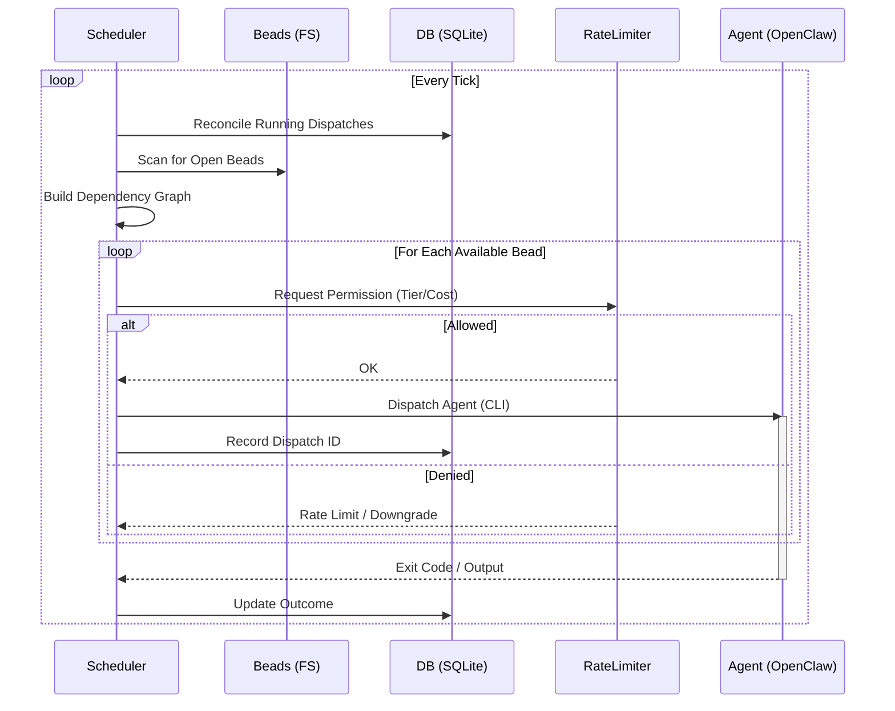

# Cortex (Developer Preview)

> **⚠️ Internal Tool / Alpha Quality**
> This software is intended for internal use. It runs arbitrary code on your machine via configured agents. **Use with extreme caution.**

**Cortex** is an autonomous agent orchestrator for developers. It reads tasks from a local backlog (Beads), spins up AI agents to solve them, and manages their lifecycle (retries, rate limits, health checks).

Think of it as a "Self-Driving Dispatcher" for your coding agents.

See:

- `docs/CORTEX_OVERVIEW.md` for what Cortex does, how it works, and how it differs from OpenClaw and Gas Town.
- `docs/CORTEX_QUICK_BRIEF.md` for a 1-page operator brief.
- `docs/CORTEX_LLM_INTERACTION_GUIDE.md` for LLM-safe operation and interaction playbooks.
- `docs/LAUNCH_READINESS_CHECKLIST.md` for go/no-go launch criteria.

## 💸 COST WARNING
**Agents are expensive.** A single coding agent loop can consume thousands of input tokens per step.
-   Cortex can and **will** burn through your API credits if you let it.
-   **Default Limits**: The example config has strict rate limits. **Do not raise them** until you are comfortable with the spend.
-   **Monitor Usage**: Check your provider's dashboard frequently.

> **DISCLAIMER: USE AT YOUR OWN RISK.**
> The authors are not responsible for your API bills, lost code, or accidental `rm -rf /`. This is an experimental autonomous system.

## How It Works

Cortex sits between your **Task List** (Beads) and your **Agent Runtime** (OpenClaw).

1.  **Plan**: You define a project and create tasks (`beads`) with acceptance criteria.
2.  **Dispatch**: Cortex's scheduler picks the next available task based on priority and rate limits.
3.  **Execute**: Cortex launches an agent (via CLI) to solve the task in your workspace.
4.  **Track**: Cortex records every dispatch, output, and outcome in a local SQLite database.

## Prerequisites

Cortex is an orchestrator, not a complete valid stack. You need:

1.  **Go 1.24+**: To build Cortex.
2.  **[Beads (`bd`)](https://github.com/steveyegge/beads)**: To manage the local task queue.
3.  **[OpenClaw](https://github.com/openclaw/openclaw)**: To actually run the agents.
4.  **SQLite**: For the state database (usually pre-installed).

## Quick Start

### 1. Build
```bash
make build
# Creates ./cortex binary
```

### 2. Configure
Copy the example config and edit it for your machine:
```bash
cp cortex.example.toml cortex.toml
nano cortex.toml
```
**Critical Settings:**
- `state_db`: Where Cortex keeps its brain (e.g., `~/.local/share/cortex/cortex.db`).
- `[projects.name]`:
    - `beads_dir`: Path to your project's `.beads` folder.
    - `workspace`: Path to your project's source code.

### 3. Run
Recommend running in `--dev` mode for visible logs:
```bash
./cortex --config cortex.toml --dev
```

## Branch and Worktree Workflow

We do not allow direct commits to `master`.

- Start all work on one of these branch types: `feature/*`, `chore/*`, `fix/*`, `refactor/*`.
- Use `git worktree` for parallel development (one feature per worktree).
- Install the local hook guard:

```bash
./scripts/hooks/install.sh
```

### Enforcement references

- `CONTRIBUTING.md` for branch naming and PR flow.
- `docs/development/GIT_WORKTREE_WORKFLOW.md` for safe parallel worktree setup.

### 4. Feed It
In another terminal, go to your project and create a task:
```bash
cd ~/projects/my-project
bd create "Fix the login page typo"
```
Cortex will detect the new bead, claim it, and dispatch an agent.

## Testing

```bash
# Run focused race tests for concurrency-critical packages
make test-race

# CI entrypoint (bounded timeout + JSON/log output under .tmp/)
make test-race-ci

# Clean bd locks (dolt/.beads lock files) before tests if needed
make cleanup-bd-locks
```

`test-safe` uses a shared SQLite lock file (`.tmp/go-test.lock`) in multi-agent/shared workspaces. To reduce lock contention, use:

```bash
TEST_SAFE_LOCK_WAIT_SEC=600 scripts/test-safe.sh ./...
```

If acquisition fails, wait for the owning runner to complete and rerun (or recheck for lingering `test-safe.sh`/`go test` processes).
`make test-race` and `make test-race-ci` now run `cleanup-bd-locks` first.

For environments where `.dolt/noms/LOCK` is persisted but not actively held, force cleanup with:

```bash
BD_LOCK_CLEANUP_FORCE=1 make cleanup-bd-locks
```

Escalation mode can be used to require explicit force before removing eligible locks:

```bash
BD_LOCK_CLEANUP_REQUIRE_FORCE=1 BD_LOCK_CLEANUP_FORCE=1 make cleanup-bd-locks
```

When escalation is active but force is not set, and `BD_LOCK_CLEANUP_REPORT_TO_MATRIX=1`, the exact lock error is sent via Matrix account (defaults to `duc`, override with `BD_LOCK_CLEANUP_MATRIX_ACCOUNT`) to `BD_LOCK_CLEANUP_MATRIX_ROOM` with no extra formatting.

`make test-race` runs through `scripts/test-safe.sh` with explicit package selection:
`internal/scheduler`, `internal/store`, `internal/learner`, `internal/dispatch`, and `internal/chief`.

## Security & Architecture

### 🛡️ Security Warning
**Cortex executes code.** The agents it spawns have the same permissions as the user running the `cortex` process.
-   **Sandboxing**: Highly recommended to run Cortex inside a container or VM if you are testing unstable agents.
-   **API**: Cortex binds to `127.0.0.1:8900` by default. **Do not expose this port**; it has no authentication.
-   **Secrets**: Do not hardcode API keys in `cortex.toml`. Use environment variables (`OPENAI_API_KEY`) ensuring the process inherits them.

### Architecture



## Configuration Reference

All configuration lives in `cortex.toml`:

### [general]

| Key | Default | Description |
|-----|---------|-------------|
| `tick_interval` | `"60s"` | How often the scheduler runs |
| `max_per_tick` | `3` | Maximum dispatches per tick |
| `stuck_timeout` | `"30m"` | When to consider a dispatch stuck |
| `max_retries` | `2` | Max retries before giving up on a bead |
| `log_level` | `"info"` | Log level: debug, info, warn, error |
| `state_db` | — | Path to SQLite database (supports `~`) |

### [projects.<name>]

| Key | Description |
|-----|-------------|
| `enabled` | Whether this project is active |
| `beads_dir` | Path to the project's `.beads/` directory |
| `workspace` | Working directory for agent dispatches |
| `priority` | Lower number = higher priority |

### [rate_limits]

| Key | Default | Description |
|-----|---------|-------------|
| `window_5h_cap` | `20` | Max authed dispatches in rolling 5h window |
| `weekly_cap` | `200` | Max authed dispatches per week |
| `weekly_headroom_pct` | `80` | Warning threshold (% of weekly cap) |

### [providers.<name>]

| Key | Description |
|-----|-------------|
| `tier` | Provider tier: fast, balanced, premium |
| `authed` | Whether this provider counts against rate limits |
| `model` | Model identifier passed to openclaw |

### [tiers]

| Key | Description |
|-----|-------------|
| `fast` | List of provider names for fast (free) tier |
| `balanced` | List of provider names for balanced tier |
| `premium` | List of provider names for premium tier |

### [dispatch.cost_control]

Optional Spark-first and churn guard policy knobs.

| Key | Default | Description |
|-----|---------|-------------|
| `enabled` | `false` | Enable policy enforcement |
| `spark_first` | `false` | Prefer `fast` tier for routine work |
| `retry_escalation_attempt` | `2` | Earliest retry count where non-fast retry tiers are allowed |
| `complexity_escalation_minutes` | `120` | Allow non-fast tier for large beads at/above this estimate |
| `risky_review_labels` | built-in list | Labels that force review escalation (e.g. security/migration) |
| `force_spark_at_weekly_usage_pct` | `0` (off) | Force Spark-only tiers once weekly authed usage reaches this percent |
| `daily_cost_cap_usd` | `0` (off) | Force Spark-only tiers once 24h recorded spend reaches cap |
| `per_bead_cost_cap_usd` | `0` (off) | Block further dispatches for beads over this cost |
| `pause_on_churn` | `false` | Pause all dispatches when system-wide churn exceeds configured thresholds |
| `churn_pause_window` | `"1h"` | Window used to evaluate system-wide churn for pausing |
| `churn_pause_failure_threshold` | `12` | Failure-like dispatch threshold (running/failed/cancelled/pending_retry/retried/interrupted) in window |
| `churn_pause_total_threshold` | `24` | Total status threshold (running/completed/failed/cancelled/pending_retry/retried/interrupted) in window |
| `pause_on_token_waste` | `false` | Pause all dispatches when 24h+ spend crosses `daily_cost_cap_usd` |
| `token_waste_window` | `"24h"` | Window for spend-based pausing |
| `per_bead_stage_attempt_limit` | `0` (off) | Max attempts per bead stage/role in window before cooldown |
| `stage_attempt_window` | `"6h"` | Rolling window for stage attempt counting |
| `stage_cooldown` | `"45m"` | Cooldown after stage attempt limit is hit |

### [health]

| Key | Default | Description |
|-----|---------|-------------|
| `check_interval` | `"2m"` | Health check frequency |
| `gateway_unit` | — | systemd unit name for the openclaw gateway |

### [reporter]

| Key | Description |
|-----|-------------|
| `channel` | Notification channel (e.g., "matrix") |
| `agent_id` | openclaw agent used for sending messages |
| `matrix_bot_account` | Optional OpenClaw Matrix account id for direct bot posting (e.g., `hg-reporter-scrum`) |
| `default_room` | Fallback Matrix room when a project does not define `matrix_room` |
| `daily_digest_time` | Time for daily digest (e.g., "09:00") |
| `weekly_retro_day` | Day for weekly retrospective (e.g., "Monday") |

### [api]

| Key | Default | Description |
|-----|---------|-------------|
| `bind` | `"127.0.0.1:8900"` | HTTP API listen address |

## Provider Setup

Add a provider to `cortex.toml`:

```toml
[providers.my-provider]
tier = "balanced"    # fast, balanced, or premium
authed = true        # counts against rate limits
model = "model-name" # passed to openclaw --model

[tiers]
balanced = ["my-provider"]  # add to appropriate tier list
```

**Tier behavior:**
- **fast**: Free providers, no rate limits, thinking=none
- **balanced**: Authed providers, rate-limited, thinking=low
- **premium**: High-capability providers, rate-limited, thinking=high

When a tier is rate-limited, Cortex automatically downgrades: premium -> balanced -> fast.

## Project Setup

1. Enable the project in `cortex.toml`:
   ```toml
   [projects.my-project]
   enabled = true
   beads_dir = "~/projects/my-project/.beads"
   workspace = "~/projects/my-project"
   priority = 1
   ```

2. Ensure the project has beads (work items) created via `bd create`

3. Create the openclaw agent for the project:
   ```bash
   openclaw agent create my-project-coder
   ```

## Monitoring

### HTTP API

```bash
# Overall status
curl http://127.0.0.1:8900/status

# List projects
curl http://127.0.0.1:8900/projects

# Project detail
curl http://127.0.0.1:8900/projects/my-project

# Health check (200=healthy, 503=unhealthy)
curl http://127.0.0.1:8900/health

# Prometheus metrics
curl http://127.0.0.1:8900/metrics
```

### Logs

In production (default), logs are JSON formatted to stderr. Use `--dev` for human-readable text format.

```bash
# Follow logs
journalctl --user -u cortex.service -f

# Filter by component
journalctl --user -u cortex.service -f | jq 'select(.component=="scheduler")'
```

## Troubleshooting

-   **Stuck Tasks**: If an agent hangs, Cortex will kill it after `stuck_timeout` (default 30m) and retry.
-   **Gateway down**: Cortex auto-restarts the gateway. Check `journalctl --user -u openclaw-gateway.service` if restarts keep failing. After 3+ restarts in 1 hour, Cortex marks the gateway as critical (visible via `/health`).
-   **Rate limit hit**: Cortex auto-downgrades tiers. Check current usage at `/status`. If all tiers are exhausted, dispatches are deferred until the 5h window rolls over.
-   **Another instance running**: Cortex uses flock at `/tmp/cortex.lock`. If you see this error after a crash, remove the lock file: `rm /tmp/cortex.lock`.
-   **Database locked**: SQLite uses WAL mode with 5s busy timeout. If you see lock errors, check for zombie cortex processes: `pgrep -a cortex`.
-   **Logs**: `journalctl --user -u cortex` (if installed as service) or stdout (if running manually).
-   **Reset**: Delete `cortex.db` to wipe all history (but not your actual code changes).

## License
MIT License - see [LICENSE](./LICENSE) file for details.
