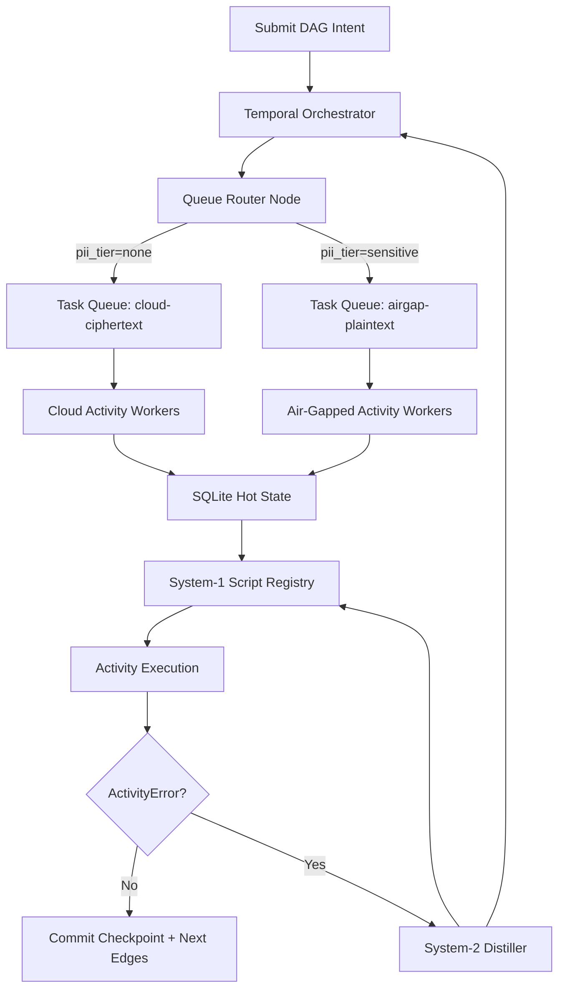

# CHUM (Continuous Hyper Utility Module)
Architected to silently devour legacy paperwork industries with deterministic precision.

> Ephemeral agents are dead. Welcome to Durable Execution.

CHUM is a deterministic execution substrate for production AI work, where every run is recoverable from state and every failure remains in-band for replay.

## Core Concept: Durable Execution

CHUM is **durable, long-lived Temporal-orchestrated execution with deterministic fallback behavior**.

- Temporal owns orchestration and checkpointed control flow.
- Stochastic operations are constrained to distillation and rewrite steps.
- All normal execution runs through deterministic System-1 scripts.
- Recovery is explicit: replay from persisted history, with bounded reroute behavior.

## Infrastructure

- **Go + Temporal SDK + SQLite Hot State**
- SQLite is the single source of execution truth: DAG nodes, frontier, retries, and checkpoints.
- File-based task tracking is rejected because high-concurrency I/O lock risk introduces nondeterministic ordering under load.
- Temporal Activities execute statelessly above a persisted SQLite control plane.

### Git Governance

Git is used only for:

- Algorithmic Crystallization PRs
- Cold Audit Snapshots

No routine scheduling, queue state, or runtime handoff should depend on Git as an operational log.

## Moat 1: The Elastic Distillation Loop

System-2 receives uncertain work and distills it into a System-1 deterministic script before execution.

Execution sequence:
1. Temporal submits the node to activity execution.
2. Deterministic script runs against pinned context.
3. On success, state advances deterministically.
4. On `ActivityError`, Temporal catches the exception at workflow scope.
5. Workflow routes to LLM-based rewrite activity.
6. Rewritten script returns to System-1.
7. Workflow replays/ retries deterministic logic and reconverges to next valid state.

This loop keeps stochasticity in a bounded control path and keeps the system stable when scripts degrade.

## Moat 2: Provable Data Sovereignty

DAG nodes carry PII policy at node scope.

- Temporal Task Queues route nodes by policy.
- Cloud workers receive only encrypted ciphertext tasks.
- Air-gapped workers process plaintext tasks for high-sensitivity nodes.
- Routing decisions are persisted in SQLite and audit-verifiable per node.

This model enforces cryptographic separation at the DAG edge rather than at project-level fiction.

The graph includes Temporal orchestration, activity workers, SQLite hot state, and queueed routing nodes.

## Execution Lifecycle

1. Ingress manifests become SQLite DAG nodes.
2. Temporal evaluates dependency readiness and dispatches eligible nodes.
3. Worker class is selected by routing policy.
4. Deterministic activity executes.
5. `ActivityError` triggers rewrite reroute.
6. Deterministic replay validates corrected script.
7. Completion commits and emits immutable audit checkpoints.

## Policy and Boundaries

- No file-based task trackers.
- No non-deterministic state updates outside persisted checkpoints.
- No plain-PII paths into cloud activity workers.
- Git usage remains limited to Algorithmic Crystallization PRs and Cold Audit Snapshots.

## Operational Notes

- Build: `make build`
- Test: `make test`
- Lint: `make lint`
- Execute: `./cortex --config <path> --dev`

- Validate health through status endpoints and workflow histories before scaling worker count.
- Use cold snapshots for incident replay.

## Documentation

- `docs/architecture/ARCHITECTURE.md`
- `docs/architecture/CONFIG.md`
- `docs/architecture/CHUM_BACKLOG.md`
- `docs/api/api-security.md`

## License

MIT — see [LICENSE](LICENSE).
