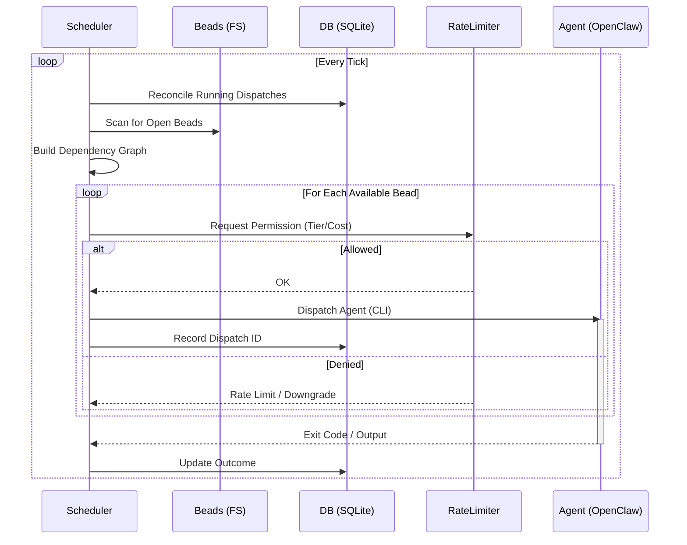

# Cortex (Developer Preview)

> **⚠️ Internal Tool / Alpha Quality**  
> This software is intended for internal use. It runs arbitrary code on your machine via configured agents. **Use with extreme caution.**

**Cortex** is an autonomous agent orchestrator for developers. It reads tasks from a local backlog (Beads), spins up AI agents to solve them, and manages their lifecycle (retries, rate limits, health checks).

Think of it as a "Self-Driving Dispatcher" for your coding agents.

## 💸 COST WARNING
**Agents are expensive.** A single coding agent loop can consume thousands of input tokens per step. 
-   Cortex can and **will** burn through your API credits if you let it.
-   **Default Limits**: The example config has strict rate limits. **Do not raise them** until you are comfortable with the spend.
-   **Monitor Usage**: Check your provider's dashboard frequently.

> **DISCLAIMER: USE AT YOUR OWN RISK.**
> The authors are not responsible for your API bills, lost code, or accidental `rm -rf /`. This is an experimental autonomous system.

## How It Works

Cortex sits between your **Task List** (Beads) and your **Agent Runtime** (OpenClaw).

1.  **Plan**: You define a project and create tasks (`beads`) with acceptance criteria.
2.  **Dispatch**: Cortex's scheduler picks the next available task based on priority and rate limits.
3.  **Execute**: Cortex launches an agent (via CLI) to solve the task in your workspace.
4.  **Track**: Cortex records every dispatch, output, and outcome in a local SQLite database.

## Prerequisites

Cortex is an orchestrator, not a complete valid stack. You need:

1.  **Go 1.24+**: To build Cortex.
2.  **[Beads (`bd`)](https://github.com/steveyegge/beads)**: To manage the local task queue.
3.  **[OpenClaw](https://github.com/openclaw/openclaw)**: To actually run the agents.
4.  **SQLite**: For the state database (usually pre-installed).

## Quick Start

### 1. Build
```bash
make build
# Creates ./cortex binary
```

### 2. Configure
Copy the example config and edit it for your machine:
```bash
cp cortex.example.toml cortex.toml
nano cortex.toml
```
**Critical Settings:**
- `state_db`: Where Cortex keeps its brain (e.g., `~/.local/share/cortex/cortex.db`).
- `[projects.name]`:
    - `beads_dir`: Path to your project's `.beads` folder.
    - `workspace`: Path to your project's source code.

### 3. Run
Recommend running in `--dev` mode for visible logs:
```bash
./cortex --config cortex.toml --dev
```

### 4. Feed It
In another terminal, go to your project and create a task:
```bash
cd ~/projects/my-project
bd create "Fix the login page typo"
```
Cortex will detect the new bead, claim it, and dispatch an agent.

## Security & Architecture

### 🛡️ Security Warning
**Cortex executes code.** The agents it spawns have the same permissions as the user running the `cortex` process.
-   **Sandboxing**: Highly recommended to run Cortex inside a container or VM if you are testing unstable agents.
-   **API**: Cortex binds to `127.0.0.1:8900` by default. **Do not expose this port**; it has no authentication.
-   **Secrets**: Do not hardcode API keys in `cortex.toml`. Use environment variables (`OPENAI_API_KEY`) ensuring the process inherits them.

### Architecture



## Troubleshooting

-   **Stuck Tasks**: If an agent hangs, Cortex will kill it after `stuck_timeout` (default 30m) and retry.
-   **Logs**: `journalctl --user -u cortex` (if installed as service) or stdout (if running manually).
-   **Reset**: Delete `cortex.db` to wipe all history (but not your actual code changes).

## License
Proprietary / Internal.
