# CHUM

**Continuous Hyper-Utility Module** — *an autonomous code factory built on [Temporal](https://temporal.io/) and [Beads](https://github.com/steveyegge/beads).*

[](https://github.com/Heikkila-Pty-Ltd/cortex/actions/workflows/ci.yml)
[](https://go.dev/)
[](https://goreportcard.com/report/github.com/Heikkila-Pty-Ltd/cortex)
[](LICENSE)

> **Sprints are dead. We built a factory.**

CHUM is an autonomous, self-improving execution engine for AI coding agents. It doesn't manage tasks — it *eats* them. A Git-backed DAG feeds micro-tasks into durable Temporal workflows. Agents code. Other agents review. Deterministic gates verify. And when the work is done, the system *learns from its own mistakes* and grows Semgrep rules that prevent them from ever happening again.

Deterministic state machines orchestrating non-deterministic models. Every failure makes the system stronger. Sharks don't make spaghetti — they eat it.

> ⚠️ **Alpha** — runs arbitrary code on your machine. You've been warned.

---

## The Pipeline

```mermaid
graph TB
    subgraph Planning["🧠 Planning Layer"]
        B[Beads DAG<br/><i>Git-backed backlog</i>]
        PC[Planning Ceremony<br/><i>Groomed → Scoped → Gated</i>]
    end

    subgraph Execution["⚡ Temporal Execution Engine"]
        W[CortexAgentWorkflow<br/><i>The Shark 🦈</i>]
        P[Plan Activity]
        HG[Human Gate<br/><i>Signal: approve/reject</i>]
        E[Execute Activity<br/><i>Primary Agent</i>]
        R[Code Review Activity<br/><i>Cross-Model Review</i>]
        SG[Semgrep Pre-Filter<br/><i>CHUM-grown rules</i>]
        D[DoD Verify Activity<br/><i>Compile / Test / Lint</i>]
    end

    subgraph CHUM["🔄 CHUM — Continuous Hyper-Utility Module"]
        L[ContinuousLearner 🧠<br/><i>Extract → Store → Crystallize</i>]
        TG[TacticalGroom 🧹<br/><i>Per-bead backlog tidy</i>]
        SGR[StrategicGroom 🔬<br/><i>Daily 5 AM deep analysis</i>]
    end

    B --> PC --> W
    W --> P --> HG --> E
    E --> R --> SG --> D
    D -->|Pass| L & TG
    D -->|Fail| E
    SGR -->|Cron 0 5 * * *| B
    L -->|Semgrep Rules| SG
```



### What Happens When You Feed It a Task

1. **Plan** — LLM generates a structured plan with acceptance criteria. No criteria, no execution. Plans are cheap; code is expensive.
2. **Human Gate** — Nothing touches your codebase until a human approves via Temporal signal. Full audit trail.
3. **Execute** — Primary agent (Claude/Codex) implements the approved plan.
4. **Cross-Model Review** — A *different* model reviews the output. Claude reviews Codex's work, Codex reviews Claude's. Self-review is cope. On rejection, agents swap roles and re-implement with the feedback injected (up to 3 handoffs).
5. **Semgrep Pre-Filter** — Custom rules (grown by the ContinuousLearner from previous failures) catch known anti-patterns *before* expensive compilation. Free and instant.
6. **DoD** — `go build`, `go test`, `go vet`. Pass or fail. No "LGTM 🚀" from someone who didn't read the diff.
7. **The Loop** — On success, two fire-and-forget child workflows spawn. They learn from the work and groom the backlog. The parent doesn't wait. `PARENT_CLOSE_POLICY_ABANDON` — sharks don't raise their children.

---

## The Moat: Algorithmic Crystallization

Most people stop at "prompt the LLM, ship the code." Here's what happens after that.

```
Agent makes mistake → Learner extracts lesson → Lesson stored in FTS5
    → Semgrep rule generated → Next execution catches it FREE
        → Mistake never reaches expensive DoD gate again
            → Over time: the factory grows its own immune system
```

The LLMs generate Semgrep rules from their own mistakes. The rules are YAML, committed to `.semgrep/`, and they run in 100ms instead of 30s. Stochastic models distilling into deterministic static analysis. Over time the repo grows its own immune system — no human writes these rules, they just appear.

---

## Benchmarks

> _First session — 2026-02-20. Four sharks, one evening._

| Metric | Value |
|--------|-------|
| **Fastest greenlight → complete** | **3m 14s** |
| SM estimate for that task | 30–60 min |
| Shark completions (session) | 4 |
| Lessons extracted | 11 |
| Semgrep rules generated | 9 |
| DoD across all runs | `go build` ✓ · `go test` ✓ · `go vet` ✓ |

### What the system taught itself

| Bead | Lessons | Rules | What it learned |
|------|---------|-------|-----------------|
| CHUM fix | 2 | 1 | Always wait for child workflow start before parent exits |
| Build fix | 3 | 2 | Don't over-build test fixtures for removed code |
| Token tracking | 3 | 3 | Persist per-phase tokens, not just aggregates |
| Tier routing | 3 | 3 | Single tier resolver, consistent return types |

The tier routing bead got rejected 3 times in cross-model review. Each rejection produced a Semgrep rule. Those rules now run against every future shark — 100ms, no LLM needed. The system learned from getting punched in the face.

See [`ARCHITECTURE.md`](docs/architecture/ARCHITECTURE.md) for phase-by-phase breakdown.

---

## Quick Start

```bash
# Build
make build

# Configure
cp configs/cortex.example.toml cortex.toml
nano cortex.toml    # Set your projects, providers, and tiers

# Start Temporal (if not running)
cd deploy/docker && docker compose up -d

# Run
./cortex --config cortex.toml --dev
```

### Feed It

```bash
cd ~/projects/my-project
bd create "Fix the login page typo"
```

CHUM picks up the bead, plans it, waits for your go-ahead, dispatches agents, reviews their work with a different model, runs DoD, learns from the result, grooms the backlog.

You drink coffee.

---

## Configuration

All config lives in `cortex.toml`. See [`CONFIG.md`](docs/architecture/CONFIG.md) for the full reference.

```toml
[general]
state_db = "~/.local/share/cortex/cortex.db"

[projects.my-project]
enabled = true
beads_dir = "~/projects/my-project/.beads"
workspace = "~/projects/my-project"

[providers.claude]
tier = "premium"
model = "claude-sonnet-4-20250514"

[tiers]
premium = ["claude"]
fast = ["codex"]
```

---

## Project Structure

```
cortex/
├── cmd/cortex/            # Entry point — API server, Temporal worker, cron
├── internal/
│   ├── temporal/          # ⚡ THE ENGINE — workflows, activities, CHUM loop
│   │   ├── workflow.go         # CortexAgentWorkflow ("The Shark") + CHUM spawn
│   │   ├── workflow_groom.go   # TacticalGroom + StrategicGroom
│   │   ├── workflow_learner.go # ContinuousLearner (Algorithmic Crystallization)
│   │   ├── activities.go       # Plan, Execute, Review, DoD
│   │   ├── groom_activities.go # Repo map, analysis, mutations, briefing
│   │   ├── learner_activities.go # Lesson extraction, FTS5 storage, Semgrep gen
│   │   ├── types.go            # Shared types
│   │   └── worker.go           # Worker bootstrap + registration
│   ├── api/               # HTTP API
│   ├── beads/             # Beads DAG integration
│   ├── config/            # TOML config with hot-reload (SIGHUP)
│   ├── dispatch/          # Agent dispatching + rate limiting
│   ├── store/             # SQLite persistence + FTS5 lesson search
│   └── ...                # Cost, matrix, portfolio, team, git
├── configs/               # Example configs
├── deploy/                # Docker + systemd
├── docs/                  # Deep architecture docs (6 mermaid diagrams)
└── scripts/               # Dev, release, hooks
```

---

## API

```bash
curl localhost:8900/status     # System status
curl localhost:8900/health     # Health check (200/503)
curl localhost:8900/projects   # List managed projects
```

> **Note:** There is no `/metrics` endpoint yet. Prometheus instrumentation is [planned](docs/api/api-security.md#prometheus-metrics). Today, use `/status` and audit logs for monitoring.

See [`api-security.md`](docs/api/api-security.md) for token auth, audit logging, and deployment patterns.

---

## Development

```bash
make help              # See all targets (grouped + color-coded)
make build             # Build cortex binary
make test              # Run all tests
make test-race         # Race detector on concurrency-critical packages
make lint-docs         # Check markdown for broken internal references
make check             # fmt + vet + test (pre-commit combo)
./scripts/hooks/install.sh   # Install git hooks
```

Branch workflow: `feature/*`, `fix/*`, `chore/*`, `refactor/*` — see [`CONTRIBUTING.md`](CONTRIBUTING.md).

---

## Roadmap

What's next. Full backlog in [`CHUM_BACKLOG.md`](docs/architecture/CHUM_BACKLOG.md).

| Feature | What it does |
|---------|-------------|
| **Monte Carlo Execution** | Fan-out N sharks on the same bead, pick the best result. Temporal makes this trivial. |
| **Ephemeral Sandboxing** | Each shark gets a throwaway Docker/Firecracker VM. No more "the agent ran `rm -rf`." |
| **AST-Driven Radar** | Tree-sitter repo map injected into every plan. Sharks know codebase topology before writing a line. |
| **MCP Integration** | Model Context Protocol client in the worker. Agents get tools, not just prompts. |
| **Estimate Calibration** | Feed `(estimated, actual)` pairs back to the SM. Current accuracy: 0.05x. Target: 0.8x. |
| **Payload Encryption** | Temporal client-side codec for PII. Cloud routes ciphertext, local workers see plaintext. |

---

## Security

CHUM executes code. Agents run with the same permissions as the process.

- **Sandbox** — Run inside a container/VM. [Ephemeral sandboxing](docs/architecture/CHUM_BACKLOG.md) is on the roadmap.
- **API** — Binds to `127.0.0.1:8900`. Do not expose without auth.
- **Secrets** — Environment variables only. Never in config files.
- **Human Gate** — Nothing executes without explicit approval.

---

## Documentation

| Doc | What's in it |
|-----|-------------|
| [`ARCHITECTURE.md`](docs/architecture/ARCHITECTURE.md) | 6 mermaid diagrams, Temporal config tables, live benchmarks |
| [`CORTEX_OVERVIEW.md`](docs/architecture/CORTEX_OVERVIEW.md) | 9 ADR-style design rationale records |
| [`CHUM_BACKLOG.md`](docs/architecture/CHUM_BACKLOG.md) | Strategic roadmap + greenfield epics |
| [`CONFIG.md`](docs/architecture/CONFIG.md) | Full configuration reference |
| [`api-security.md`](docs/api/api-security.md) | Token auth, audit logging, deployment patterns |

---

## Known Limitations

Cortex is alpha. These are real gaps, not features:

| Gap | Impact | Status |
|-----|--------|--------|
| **No Prometheus metrics** | `/metrics` endpoint doesn't exist yet; monitoring uses `/status` + audit logs | Planned — metric schema defined in [api-security.md](docs/api/api-security.md) |
| **No sandboxing** | Agents run with host process permissions; a hallucinated `rm -rf` is your problem | Planned — ephemeral Docker/Firecracker is on the [roadmap](docs/architecture/CHUM_BACKLOG.md) |
| **Single-host SQLite** | No horizontal worker scaling; state DB is a local file | Acceptable for current throughput; Postgres migration path exists |
| **No RBAC** | API auth is token-based, no role differentiation | Control vs read-only endpoint split is enforced; fine-grained roles are not |
| **Test coverage** | Integration tests exist but edge-case coverage is thin | Improving via CHUM's own DoD requirements on every bead |
| **No web UI** | All interaction via CLI, API, or Matrix commands | By design — Cortex is an engine, not a dashboard |

---

## License

MIT — see [LICENSE](LICENSE).
