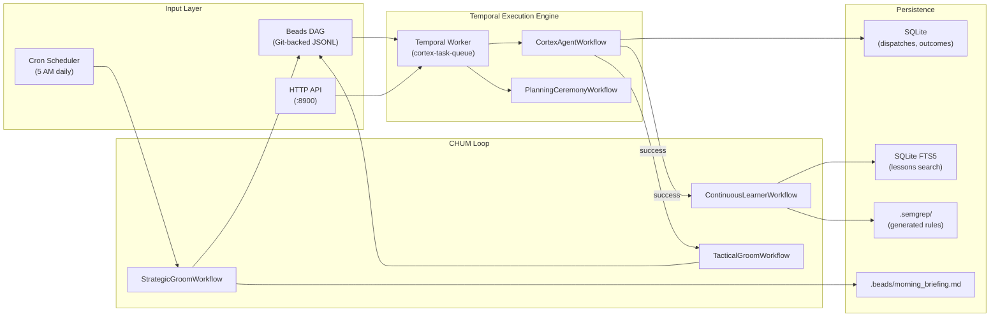
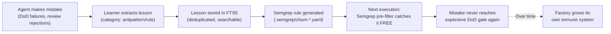

# Cortex Architecture

> Deep technical reference for the Cortex execution engine, CHUM learning loop, and Temporal workflow topology.

---

## System Overview

Cortex is a **durable, self-healing agent orchestrator** composed of three layers:



---

## Workflow Topology

### CortexAgentWorkflow — "The Shark"

The main execution loop. Implements a LeSS/SCRUM-inspired pipeline with deterministic DoD gating.

```mermaid
stateDiagram-v2
    [*] --> Plan
    Plan --> HumanGate: Structured plan generated
    HumanGate --> Execute: APPROVED signal
    HumanGate --> Rejected: REJECTED signal
    Rejected --> [*]

    Execute --> Review: Agent output
    Review --> SemgrepFilter: Review APPROVED
    Review --> SwapAgents: Review REJECTED

    SwapAgents --> Execute: Agents swapped (≤3 handoffs)

    SemgrepFilter --> DoDVerify: Semgrep PASSED
    SemgrepFilter --> Execute: Semgrep FAILED (retry with errors)

    DoDVerify --> Success: DoD PASSED
    DoDVerify --> Execute: DoD FAILED (≤3 retries)
    DoDVerify --> Escalate: All retries exhausted

    Success --> SpawnCHUM: Record outcome
    SpawnCHUM --> [*]: Learner + Groom started

    Escalate --> [*]: Human notified
```



**Key design decisions:**
- **Planning is gated.** Plans without acceptance criteria are rejected before any code is written. *"Plan space is cheap, implementation is expensive."*
- **Cross-model review.** Claude reviews Codex's work, Codex reviews Claude's. This catches model-specific blind spots that self-review misses.
- **Agent swapping on rejection.** When a review fails, the reviewer becomes the implementer with the review feedback injected. Up to 3 handoffs before escalation.
- **Semgrep pre-filter.** Custom rules generated by the Learner catch known anti-patterns *before* expensive `go build`/`go test`. Free and fast.

### Cross-Model Review Handoff


---

## CHUM — Continuous Hyper-Utility Module

CHUM implements a **dual-speed Kanban** system. Both speeds run as **abandoned child workflows** — they survive the parent completing and never block the main execution loop.

### Dual-Speed Architecture

```mermaid
graph TB
    subgraph Fast["⚡ Event-Driven (per bead)"]
        direction TB
        CL["ContinuousLearner"]
        TG["TacticalGroom"]

        CL --> EL["ExtractLessons<br/>(fast LLM)"]
        EL --> SL["StoreLessons<br/>(SQLite FTS5)"]
        SL --> GR["GenerateSemgrepRules<br/>(enforceable lessons only)"]

        TG --> MB["MutateBeads<br/>(reprioritize, add deps, close stale)"]
    end

    subgraph Slow["🔬 Daily Cron (5 AM)"]
        direction TB
        SG["StrategicGroom"]

        SG --> RM["GenerateRepoMap<br/>(go list + go doc)"]
        RM --> BS["GetBeadStateSummary<br/>(compressed backlog)"]
        BS --> SA["StrategicAnalysis<br/>(premium LLM)"]
        SA --> AM["ApplyMutations<br/>(capped at 5)"]
        AM --> BF["GenerateMorningBriefing<br/>(.beads/morning_briefing.md)"]
    end

    DoD["DoD PASSED"] -->|"fire-and-forget<br/>PARENT_CLOSE_POLICY_ABANDON"| CL & TG
    CRON["Cron 0 5 * * *"] --> SG
```



### The Learning Feedback Loop (LATM)

This is the **Algorithmic Crystallization** loop — the system converts stochastic LLM behavior into deterministic static analysis rules:



---

## Temporal Configuration

### Task Queue

All workflows run on `cortex-task-queue`. Single shared queue simplifies deployment.

### Child Workflow Policies

| Workflow | Launch | Parent Policy | Scheduling |
|----------|--------|---------------|------------|
| `CortexAgentWorkflow` | API trigger | — | On-demand |
| `PlanningCeremonyWorkflow` | API trigger | — | On-demand |
| `ContinuousLearnerWorkflow` | Child of Shark | ABANDON | Per bead completion |
| `TacticalGroomWorkflow` | Child of Shark | ABANDON | Per bead completion |
| `StrategicGroomWorkflow` | Temporal Client | — | Cron `0 5 * * *` |

### Activity Timeout Design

| Activity | Timeout | Heartbeat | Retries | Rationale |
|----------|---------|-----------|---------|-----------|
| Plan | 5m | — | 2 | LLM generation, bounded |
| Execute | 15m | 30s | 1 | Agent coding, needs heartbeat for long runs |
| Review | 5m | — | 2 | LLM review, bounded |
| DoD | 5m | — | 1 | Compile + test, deterministic |
| Extract Lessons | 3m | — | 2 | Fast LLM, bounded |
| Strategic Analysis | 10m | 30s | 2 | Premium LLM, may be slow |

---

## Data Flow

### SQLite Schema (Key Tables)

```
dispatches     — Every agent dispatch (bead_id, agent, provider, status, duration)
dod_results    — DoD pass/fail per dispatch (passed, failures, coverage)
lessons        — Extracted lessons (category, summary, detail, file_paths, labels)
lessons_fts    — FTS5 virtual table for full-text lesson search
health_events  — System health events (escalations, gateway issues)
```

### File System Layout

```
workspace/
├── .beads/                    # Beads DAG (issues.jsonl, deps)
│   └── morning_briefing.md    # StrategicGroom daily output
├── .semgrep/                  # CHUM-generated rules
│   ├── chum-nil-check-*.yaml  # Auto-generated from learner
│   └── chum-error-wrap-*.yaml
└── .cortex/                   # Runtime state (gitignored)
    └── cortex.db              # SQLite state database
```

---

## Security Model

- **No sandbox by default.** Agents run with the same permissions as the Cortex process. Sandboxing is on the [roadmap](CHUM_BACKLOG.md).
- **API binds to localhost.** No authentication on the HTTP API — do not expose.
- **Human gate.** Nothing enters the coding engine without explicit signal approval.
- **Semgrep enforcement.** Generated rules run before DoD, catching known-bad patterns.

---

## Live Benchmarks

> _Measured from the first production Shark execution on 2026-02-20._

### Execution: `exec-fix-broken-build` (api_test.go build fix)

| Phase | Duration | Notes |
|-------|----------|-------|
| PlanningCeremony (4 questions + summary) | 3m 31s | Interactive human-in-the-loop |
| StructuredPlan generation | ~2m 30s | LLM analyzes codebase, generates 12-step plan |
| Human gate → approval | instant | Pre-approved from ceremony |
| **ExecuteActivity** | **~2m** | **Agent writes code** |
| CodeReview + Semgrep + DoD | ~1m | Cross-model review + compile/test/vet |
| CHUM spawn (Learner + Groom) | <1s | Both children started before parent completed |
| **Total: greenlight → done** | **3m 14s** | **SM estimated 30-60 minutes (16x overestimate)** |

### CHUM Loop Confirmation

```
Event 45: StartChildWorkflowExecutionInitiated  → Learner spawned
Event 46: StartChildWorkflowExecutionInitiated  → TacticalGroom spawned
Event 47: ChildWorkflowExecutionStarted         → Learner STARTED ✓
Event 49: ChildWorkflowExecutionStarted         → TacticalGroom STARTED ✓
Event 52: WorkflowExecutionCompleted            → Parent exits cleanly
```

Both abandoned children survived parent completion — `PARENT_CLOSE_POLICY_ABANDON` + `GetChildWorkflowExecution().Get()` pattern confirmed working in production.

### Verification

```
go build ./...  → PASS
go test ./...   → PASS (api package)
go vet ./...    → PASS
```

